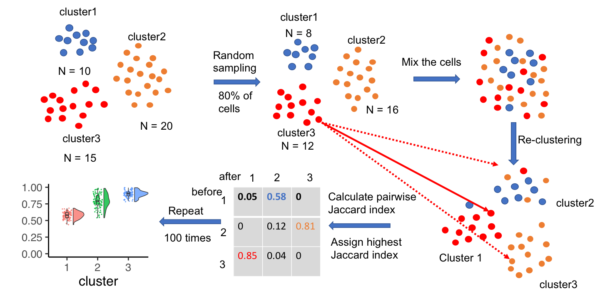
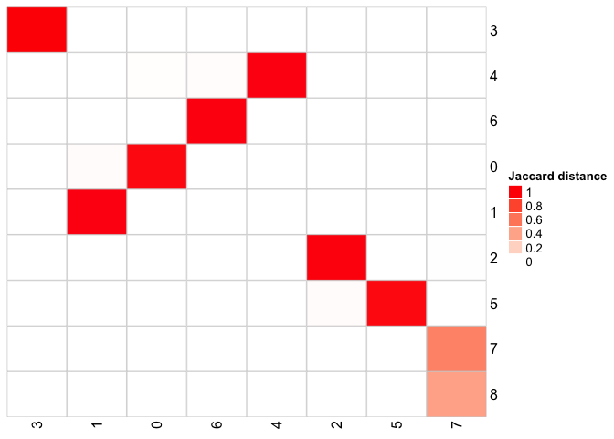
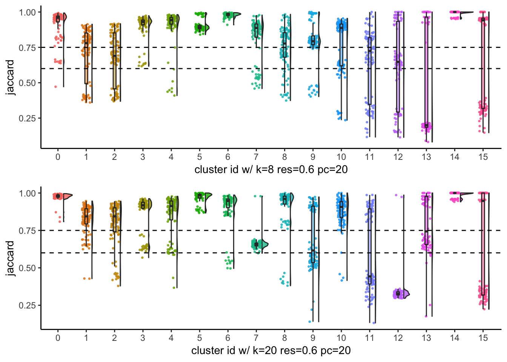

<!-- README.md is generated from README.Rmd. Please edit that file -->

[](https://travis-ci.com/crazyhottommy/scclusteval)

# scclusteval

<div class="figure">


<p class="caption">

hex sticker

</p>

</div>

The goal of scclusteval(Single Cell Cluster Evaluation) is to evaluate
the single cell clustering stability by subsampling the cells and
provide many visualization methods for comparing clusters.

For Theory behind the method, see Christian Henning, “Cluster-wise
assessment of cluster stability,” Research Report 271, Dept. of
Statistical Science, University College London, December 2006)

### Citation

Ming Tang, Yasin Kaymaz,Brandon L. Logeman, Stephen Eichhorn, Zhengzheng
S. Liang, Catherine Dulac and Timothy B. Sackton. Evaluating single-cell
cluster stability using the Jaccard similarity index (2020)
*Bioinformatics*  btaa956, https://doi.org/10.1093/bioinformatics/btaa956.

### Parameters that affect the clustering

The most popular clustering method for single cell RNAseq is shared
nearest neighbor (SNN) followed by Louvain community detection algorithm 
which is implemented in `{Seurat::FindClusters}`.
See a paper by Mark Robinson group for comparing single cell RNAseq
clustering methods:[A systematic performance evaluation of clustering
methods for single-cell RNA-seq
data](https://f1000research.com/articles/7-1141/v1) SNN in Seurat is the
most accurate and fast one.

The parameter `k.param` which specifies the number of nearest neighbors
has a great effect on the number of clusters. Other Parameters such as
the number of PCs and the resolution can affect the number of clusters
as well.

The process is as follows.

To assess which k is best to use by subsampling the original data:

1.  Performing the clustering at many different K values on the full
    data set.

2.  We then sample without replacement a subset of the data set
    (e.g. 80% of the cells in the full data set), and then repeat the
    clustering procedure on just this subset of data (so repeating all
    aspects of clustering, including calling variable genes, calculating
    PCs, building the neighbor graph, etc), and we do this n times.

3.  So for each K value, we have 1 clustering outcome for the full data
    set, and 20 clustering outcomes for subsampled portions of the data
    set. From this we identify the cluster in the first subsample
    clustering that is most similar to the full cluster 1 cells (the one
    that gives the maximum Jaccard coefficient) and record that value.
    If this maximum Jaccard coefficient is less than 0.6 (this is quite
    subjective), the original cluster is considered to be dissolved-it
    didn’t show up in the new clustering. A cluster that’s dissolved too
    often is probably not a “real” cluster.

> As a rule of thumb, clusters with a stability value less than 0.6
> should be considered unstable. Values between 0.6 and 0.75 indicate
> that the cluster is measuring a pattern in the data, but there isn’t
> high certainty about which points should be clustered together.
> Clusters with stability values above about 0.85 can be considered
> highly stable (they’re likely to be real clusters).

4.  Repeat this for all subsample clustering outcomes, and then the
    stability value of a cluster is the median or mean Jaccard
    coefficient. If it’s greater than 0.6 (or a cutoff you set) we say
    it’s stable, otherwise it’s unstable. So for a given K value this
    gives you a stable/unstable assignment for each cluster. We choose
    the k value to select for clustering the data by looking at which k
    value yielded the largest number of stable clusters while still
    having most of the cells from the data set in a stable cluster.

We can repeat the 1-4 for different resolution and number of PCs and the
combination of all different parameters.

The workflow is:



## The subsampling process is implemented in a Snakemake workflow

Because for each subsampling, one has to re-run the whole process of
`FindVariableGenes`, `ScaleData`, `RunPCA`, `JackStraw` and
`FindClusters` and for large data set, it can take very long time to
run.

E.g. if you test 5 different K, and for each K you subsample the full
dataset 100 times. that’s 500 runs.

Snakemake will take advantage of the HPC cluster with large number of
CPUs avaiable.

The R package works with the output from the Snakemake workflow:
[pyflow\_seuratv3\_parameter](https://github.com/crazyhottommy/pyflow_seuratv3_parameter).

## The scclusteval R package is for downstream analysis

### Installation

You can install the scclusteval from github:

``` r
devtools::install_github("crazyhottommy/scclusteval")
```

## Useful functions

``` r
library(scclusteval)
#> Loading required package: Seurat
?RandomSubsetData
?MergeMultipleSeuratObjects
?PreprocessSubsetData
?PairWiseJaccardSets

## in Rstudio type below and tab to see all avaiable functions
## scclusteval::
```

## Examples

Examples to use the `scclusteval` package can be found at
<https://crazyhottommy.github.io/EvaluateSingleCellClustering/>





## Acknowledgements

Thanks to Tim Sackton and Catherine Dulac for their supervision and
support.  
Thanks to Yasin Kaymaz in Sackton group for fruitful discussion.  
Thanks to Stephen Eichhorn in Xiaowei Zhuang lab for the idea and
sharing the python code working on
[Scanpy](https://github.com/theislab/scanpy) object.  
Thanks to Sophia(Zhengzheng) Liang and Brandon Logeman in Dulac lab for
sharing data and giving feedbacks.  
Thanks [David Robinson](https://twitter.com/drob)’s `geomflatviolin`
function which was used in the `raincloudplot`.

## Why this package?

I saw `{fpc}` package has a function `clusterboot`. However, this
function does not support SNN clustering. Although one can write a
customer clustering function to feed into clusterboot, I need to build
things upon `Seurat` package and those two can not be easilily
integrated. In addition, `clusterboot` is not parallelized, I have to
implement the `snakemake` workflow for faster processing.

read this blog post
<http://www.win-vector.com/blog/2015/09/bootstrap-evaluation-of-clusters/>
and <https://www.czasopisma.uni.lodz.pl/foe/article/view/983>

## To do list

  - \[x\] implement more visualization functions.
  - \[ \] plot number of cells subsampled for each cluster in each
    iteration in raincloudplot.
  - \[ \] impurity metric for assessing cluster stability.
  - \[ \] read this post from Jean Fan from Xiaowei Zhuang’s lab
    <https://jef.works/blog/2018/02/28/stability-testing/>
    `getComMembership` function works on raw data matrix. It can be used
    independent of Seurat’s `FindClusters`. chat with Jean for more
    details.
  - \[ \] gene sets enrichment for each cluster.
