<!-- README.md is generated from README.Rmd. Please edit that file -->

# scclusteval


The goal of scclusteval(Single Cell Cluster Evaluation) is to evaluate
the single cell clustering stability by boostrapping/subsampling the
cells and provide many visualization methods for comparing clusters.

for Theory behind the method, see Christian Henning, “Cluster-wise
assessment of cluster stability,” Research Report 271, Dept. of
Statistical Science, University College London, December 2006)

### Parameters that affect the clustering

The most popular clustering method for single cell RNAseq is shared
nearest neighbor (SNN) which is implemented in `{Seurat::FindClusters}`.
See a paper by Mark Robinson group for comparing single cell RNAseq
clustering methods:[A systematic performance evaluation of clustering
methods for single-cell RNA-seq
data](https://f1000research.com/articles/7-1141/v1) SNN in Seurat is the
most accurate and fast one.

The parameter `k.param` which specifies the number of nearest neighbors
has a great effect on the number of clusters.

The process is as follows (paraphased from Stephen Eichhorn in Xiaowei
Zhuang lab) to assess which k is best to use by subsampling the original
data:

1.  Performing the clustering at many different K values on the full
    data set.

2.  We then sample without replacement a subset of the data set
    (e.g. 80% of the cells in the full data set), and then repeat the
    clustering procedure on just this subset of data (so repeating all
    aspects of clustering, including calling variable genes, calculating
    PCs, building the neighbor graph, etc), and we do this n times.

3.  So for each K value, we have 1 clustering outcome for the full data
    set, and 20 clustering outcomes for subsampled portions of the data
    set. From this we identify the cluster in the first subsample
    clustering that is most similar to the full cluster 1 cells (the one
    that gives the maximum Jaccard coefficient) and record that value.
    If this maximum Jaccard coefficient is less than 0.6 (this is quite
    subjective), the original cluster is considered to be dissolved-it
    didn’t show up in the new clustering. A cluster that’s dissolved too
    often is probably not a “real” cluster.

> As a rule of thumb, clusters with a stability value less than 0.6
> should be considered unstable. Values between 0.6 and 0.75 indicate
> that the cluster is measuring a pattern in the data, but there isn’t
> high certainty about which points should be clustered together.
> Clusters with stability values above about 0.85 can be considered
> highly stable (they’re likely to be real clusters).

4.  Repeat this for all subsample clustering outcomes, and then the
    stability value of a cluster is the median or mean Jaccard
    coefficient. If it’s greater than 0.6 (or a cutoff you set) we say
    it’s stable, otherwise it’s unstable. So for a given K value this
    gives you a stable/unstable assignment for each cluster. We choose
    the k value to select for clustering the data by looking at which k
    value yielded the largest number of stable clusters while still
    having most of the cells from the data set in a stable cluster.

## Installation

You can install the scclusteval from github:

``` r
devtools::install_github("crazyhottommy/scclusteval")
```

## Useful functions

``` r
library(scclusteval)
#> Loading required package: Seurat
#> Loading required package: ggplot2
#> Loading required package: cowplot
#> 
#> Attaching package: 'cowplot'
#> The following object is masked from 'package:ggplot2':
#> 
#>     ggsave
#> Loading required package: Matrix
?RandomSubsetData
?MergeMultipleSeuratObjects
?PreprocessSubsetData
?PairWiseJaccardSets

## in Rstudio type below and tab to see all avaiable functions
## scclusteval::
```

## The subsampling/bootstrap process is implemented in a Snakemake workflow

**Todo: resampling with replacement (bootstrap).**

Because for each subsampling/bootstrap, one has to re-run the whole
process of `FindVariableGenes`, `ScaleData`, `RunPCA`, `JackStraw` and
`FindClusters` and for large data set, it can take very long time to
run.

E.g. if you bootstrap 5 different K, and for each K you bootstrap 100
times. that’s 500 runs.

Snakemake will take advantage of the HPC cluster with large number of
CPUs avaiable.

Find the Snakemake workflow
[scBootClusterSeurat](https://github.com/crazyhottommy/scBootClusterSeurat).

## Example

This is a basic example which shows you some useful functions in the
package.

The `rds` in this example can be downloaded from <https://osf.io/4c9h2/>

the 3k pmbc data set is the same as used in the `Seurat` tutorial. I
subsampled 80% of the cells, and recluster for 100 times for 10
different ks =6,8,10,12,14,16,20,25,30,35. for total 1000 runs and
recorded the cell identities before and after reclustering into a list.
The whole process was done by the Snakemake workflow:
[scBootClusterSeurat](https://github.com/crazyhottommy/scBootClusterSeurat).

``` r
library(tidyverse)
#> ── Attaching packages ──────────────────────────────────────────────────────────────── tidyverse 1.2.1 ──
#> ✔ tibble  1.4.2     ✔ purrr   0.2.5
#> ✔ tidyr   0.8.2     ✔ dplyr   0.7.8
#> ✔ readr   1.3.1     ✔ stringr 1.3.1
#> ✔ tibble  1.4.2     ✔ forcats 0.3.0
#> ── Conflicts ─────────────────────────────────────────────────────────────────── tidyverse_conflicts() ──
#> ✖ tidyr::expand()   masks Matrix::expand()
#> ✖ dplyr::filter()   masks stats::filter()
#> ✖ cowplot::ggsave() masks ggplot2::ggsave()
#> ✖ dplyr::lag()      masks stats::lag()
library(scclusteval)
library(here)
#> here() starts at /Users/mingtang/github_repos/scclusteval

ks_idents_original<- readRDS("~/Downloads/ks_pbmc_original_idents.rds")

PairWiseJaccardSetsHeatmap(ks_idents_original$`6`, ks_idents_original$`8`,
                           show_row_dend = F, show_column_dend = F,
                           cluster_row = F, cluster_column =F)
```


``` r

PairWiseJaccardSetsHeatmap(ks_idents_original$`30`, ks_idents_original$`8`,
                           show_row_dend = F, show_column_dend = F,
                           cluster_row = F, cluster_column =F)
```

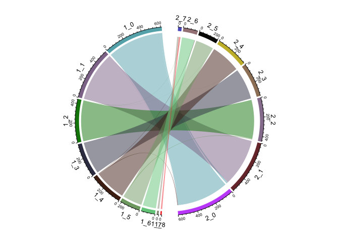

``` r

PairWiseJaccardSetsHeatmap(ks_idents_original$`30`, ks_idents_original$`35`,
                           show_row_dend = F, show_column_dend = F,
                           cluster_row = F, cluster_column =F)
```

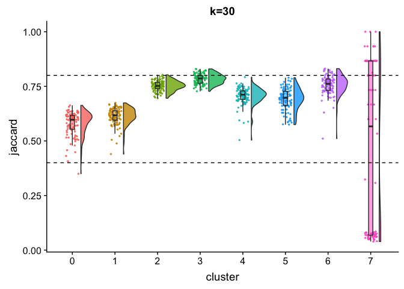

``` r

## cluster number for each k
lapply(ks_idents_original, function(x) length(unique(x)))
#> $`10`
#> [1] 10
#> 
#> $`12`
#> [1] 9
#> 
#> $`14`
#> [1] 9
#> 
#> $`16`
#> [1] 9
#> 
#> $`20`
#> [1] 9
#> 
#> $`25`
#> [1] 8
#> 
#> $`30`
#> [1] 8
#> 
#> $`35`
#> [1] 8
#> 
#> $`6`
#> [1] 9
#> 
#> $`8`
#> [1] 9

## how many cells identity change from one cluster to another
ClusterIdentityChordPlot(ks_idents_original$`10`, ks_idents_original$`30`)
```

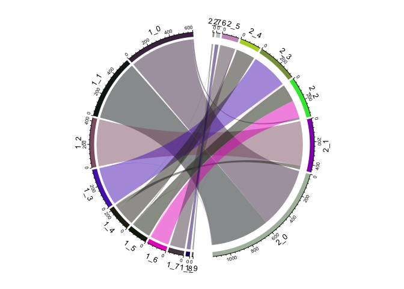

``` r

## cluster size plot
ClusterSizeBarplot(ks_idents_original$`30`)
```

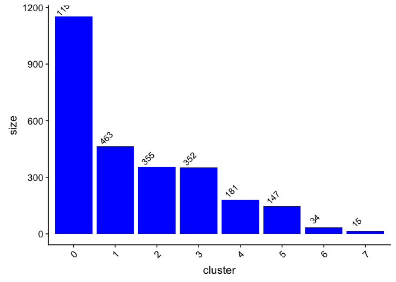

### for the subsampled data set

``` r
# a list of lists, 10 different ks
ks_idents<- readRDS("~/Downloads/gather_bootstrap_k.rds")
length(ks_idents)
#> [1] 2
lapply(ks_idents, length)
#> $original_idents
#> [1] 10
#> 
#> $idents
#> [1] 10

ks_idents_original_subsample<- ks_idents$original_idents
ks_idents_recluster_subsample<- ks_idents$idents

lapply(ks_idents_original_subsample, length)
#> $`10`
#> [1] 100
#> 
#> $`12`
#> [1] 100
#> 
#> $`14`
#> [1] 100
#> 
#> $`16`
#> [1] 100
#> 
#> $`20`
#> [1] 100
#> 
#> $`25`
#> [1] 100
#> 
#> $`30`
#> [1] 100
#> 
#> $`35`
#> [1] 100
#> 
#> $`6`
#> [1] 100
#> 
#> $`8`
#> [1] 100
lapply(ks_idents_recluster_subsample, length)
#> $`10`
#> [1] 100
#> 
#> $`12`
#> [1] 100
#> 
#> $`14`
#> [1] 100
#> 
#> $`16`
#> [1] 100
#> 
#> $`20`
#> [1] 100
#> 
#> $`25`
#> [1] 100
#> 
#> $`30`
#> [1] 100
#> 
#> $`35`
#> [1] 100
#> 
#> $`6`
#> [1] 100
#> 
#> $`8`
#> [1] 100

## check for one of the subsample experiment for k=10, the cell identities 
## should be the same before and after clustering, but the cluster identities 
## should be different

identical(names(ks_idents_original_subsample$`30`[[1]]), names(ks_idents_recluster_subsample$`30`[[1]]))
#> [1] TRUE


table(ks_idents_original_subsample$`30`[[1]])
#> 
#>   0   1   2   3   4   5   6   7 
#> 903 372 288 278 159 119  32   9
table(ks_idents_recluster_subsample$`30`[[1]])
#> 
#>   0   1   2   3   4   5   6 
#> 922 383 279 264 159 122  31

identical(names(ks_idents_original_subsample$`10`[[100]]),  names(ks_idents_recluster_subsample$`10`[[100]]))
#> [1] TRUE

table(ks_idents_original_subsample$`10`[[100]])
#> 
#>   0   1   2   3   4   5   6   7   8   9 
#> 471 444 351 282 174 146 139 114  27  12
table(ks_idents_recluster_subsample$`10`[[100]])
#> 
#>   0   1   2   3   4   5   6   7   8   9 
#> 519 399 357 282 260 166 129  28  12   8
```

### Jaccard Raincloud plot for different Ks

``` r
# can take ~30 seconds for 80 clusters
JaccardRainCloudPlot(ks_idents_original_subsample$`6`, ks_idents_recluster_subsample$`6`) + 
        geom_hline(yintercept = c(0.6, 0.75), linetype = 2) +
        ggtitle("k=6")
```


``` r

JaccardRainCloudPlot(ks_idents_original_subsample$`8`, ks_idents_recluster_subsample$`8`) + 
        geom_hline(yintercept = c(0.6, 0.75), linetype = 2) +
        ggtitle("k=8")
```

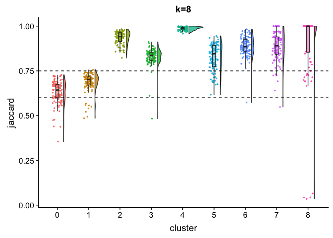

``` r

JaccardRainCloudPlot(ks_idents_original_subsample$`10`, ks_idents_recluster_subsample$`10`) + 
        geom_hline(yintercept = c(0.6, 0.75), linetype = 2) +
        ggtitle("k=10")
```

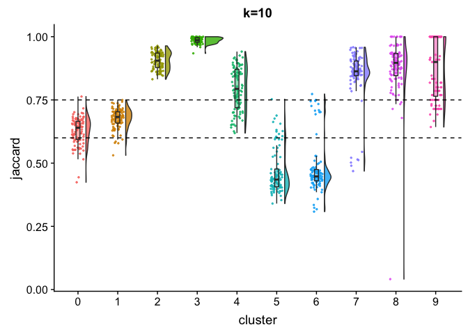

``` r

JaccardRainCloudPlot(ks_idents_original_subsample$`12`, ks_idents_recluster_subsample$`12`) + 
        geom_hline(yintercept = c(0.6, 0.75), linetype = 2) +
        ggtitle("k=12")
```

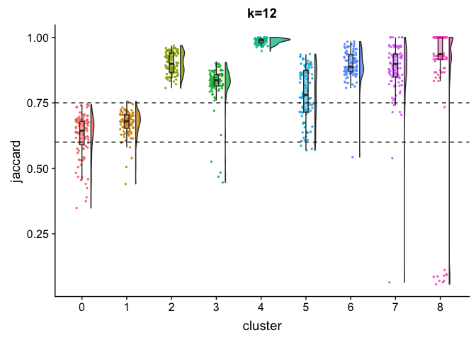

``` r

JaccardRainCloudPlot(ks_idents_original_subsample$`14`, ks_idents_recluster_subsample$`14`) + 
        geom_hline(yintercept = c(0.6, 0.75), linetype = 2) +
        ggtitle("k=14")
```

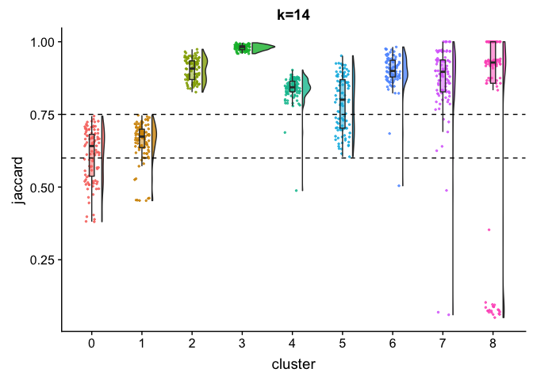

``` r

JaccardRainCloudPlot(ks_idents_original_subsample$`16`, ks_idents_recluster_subsample$`16`) + 
        geom_hline(yintercept = c(0.6, 0.75), linetype = 2) +
        ggtitle("k=16")
```

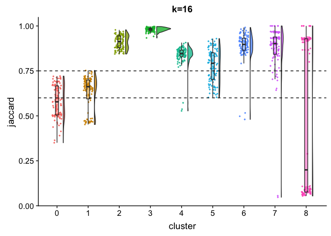

``` r

JaccardRainCloudPlot(ks_idents_original_subsample$`20`, ks_idents_recluster_subsample$`20`) + 
        geom_hline(yintercept = c(0.6, 0.75), linetype = 2) +
        ggtitle("k=20")
```

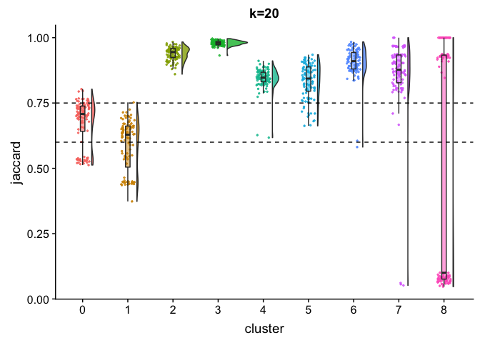

``` r

JaccardRainCloudPlot(ks_idents_original_subsample$`25`, ks_idents_recluster_subsample$`25`) + 
        geom_hline(yintercept = c(0.6, 0.75), linetype = 2) +
        ggtitle("k=25")
```

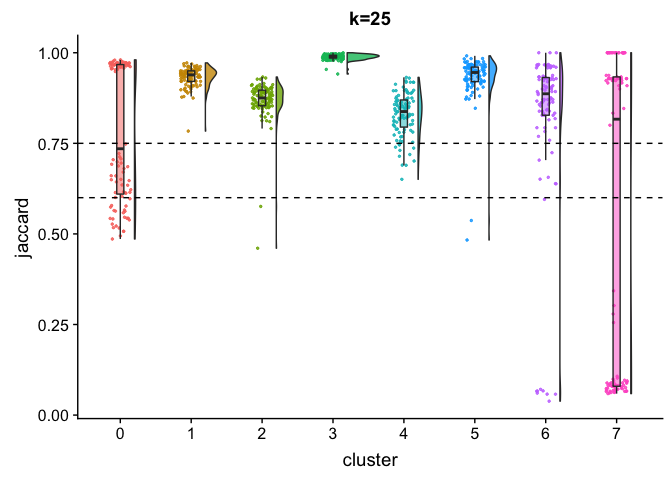

``` r

JaccardRainCloudPlot(ks_idents_original_subsample$`30`, ks_idents_recluster_subsample$`30`) + 
        geom_hline(yintercept = c(0.6, 0.75), linetype = 2) +
        ggtitle("k=30")
```

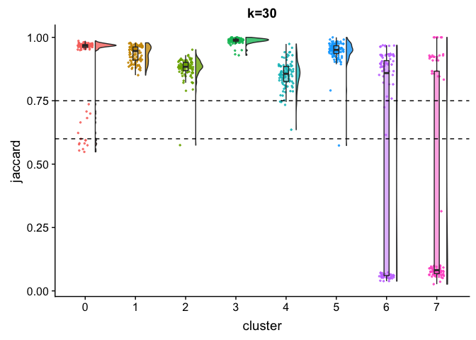

``` r

JaccardRainCloudPlot(ks_idents_original_subsample$`35`, ks_idents_recluster_subsample$`35`) + 
        geom_hline(yintercept = c(0.6, 0.75), linetype = 2) +
        ggtitle("k=35")
```

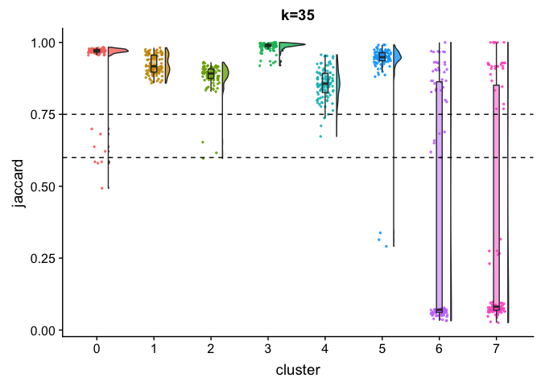

``` r

# purrr::map2(ks_idents_original_subsample, ks_idents_recluster_subsample, JaccardRainCloudPlot)
```

### How many stable cluster and percentage of cells for each K

``` r
## for one K, take ~20 seconds
AssignHighestJaccard(ks_idents_original_subsample$`30`, ks_idents_recluster_subsample$`30`)
#> # A tibble: 100 x 8
#>      `0`   `1`   `2`   `3`   `4`   `5`    `6`    `7`
#>    <dbl> <dbl> <dbl> <dbl> <dbl> <dbl>  <dbl>  <dbl>
#>  1 0.971 0.971 0.884 0.996 0.882 0.959 0.969  0.0566
#>  2 0.969 0.962 0.892 0.948 0.974 0.976 0.0403 0.933 
#>  3 0.956 0.968 0.860 0.996 0.942 1     0.885  0.867 
#>  4 0.708 0.938 0.930 0.993 0.831 0.952 0.885  0.0506
#>  5 0.966 0.976 0.879 0.982 0.849 0.942 0.897  0.0962
#>  6 0.962 0.876 0.862 0.993 0.636 0.924 0.897  0.0870
#>  7 0.968 0.965 0.883 0.993 0.862 0.967 0.968  0.0616
#>  8 0.975 0.916 0.901 0.997 0.752 0.943 0.931  1     
#>  9 0.976 0.942 0.920 0.992 0.787 0.976 0.926  0.0889
#> 10 0.972 0.976 0.901 0.982 0.854 0.976 0.897  0.0921
#> # ... with 90 more rows

k30_stable<- AssignStableCluster(ks_idents_original_subsample$`30`, ks_idents_recluster_subsample$`30`, cutoff = 0.6)

CalculatePercentCellInStable(ks_idents_original$`30`, k30_stable$stable_cluster)
#> [1] 0.9944444
## for all Ks, 10 different ks, 200 seconds. think about how to speed up.
ks_stable<- purrr::map2(ks_idents_original_subsample, ks_idents_recluster_subsample, ~AssignStableCluster(idents1= .x, idents2 = .y, cutoff = 0.6))

BootParameterScatterPlot(ks_stable = ks_stable, ks_idents_original = ks_idents_original)
```

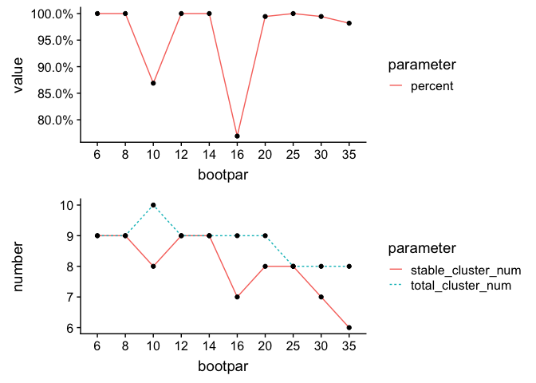

## Acknowledgements

Thanks to Tim Sackton and Catherin Dulac for their supervision and
support.  
Thanks to Yasin Kaymaz in Sackton group for fruitful discussion.  
Thanks to Stephen Eichhorn in Xiaowei Zhuang lab for the idea and
sharing the python code working on
[Scanpy](https://github.com/theislab/scanpy) object.  
Thanks to Sophia(Zhengzheng) Liang in Dulac lab for sharing data and
giving feedbacks.

## Why this package?

I saw `{fpc}` package has a function `clusterboot`. However, this
function does not support SNN clustering. Although one can write a
customer clustering function to feed into clusterboot, I need to build
things upon `Seurat` package and those two can not be easilily
integrated. In addition, `clusterboot` is not parallelized, I have to
implement the `snakemake` workflow for faster processing.

read this blog post
<http://www.win-vector.com/blog/2015/09/bootstrap-evaluation-of-clusters/>
and <https://www.czasopisma.uni.lodz.pl/foe/article/view/983>

## To do list

  - adding checks for all functions. `stop` messages.
  - implement more visualization functions.
  - plot number of cells subsampled for each cluster in each iteration
    in raincloudplot.
  - impurity metric for assessing cluster stability.
  - read this post from Jean Fan from Xiaowei Zhuang’s lab
    <https://jef.works/blog/2018/02/28/stability-testing/>
    `getComMembership` function works on raw data matrix. It can be used
    independent of Seurat’s `FindClusters`. chat with Jean for more
    details.
  - gene sets enrichment for each cluster.
