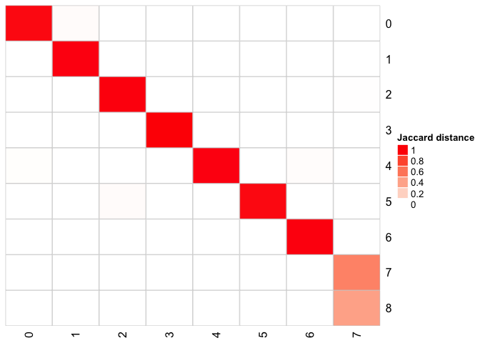
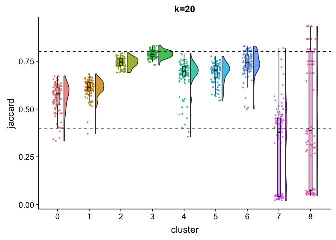
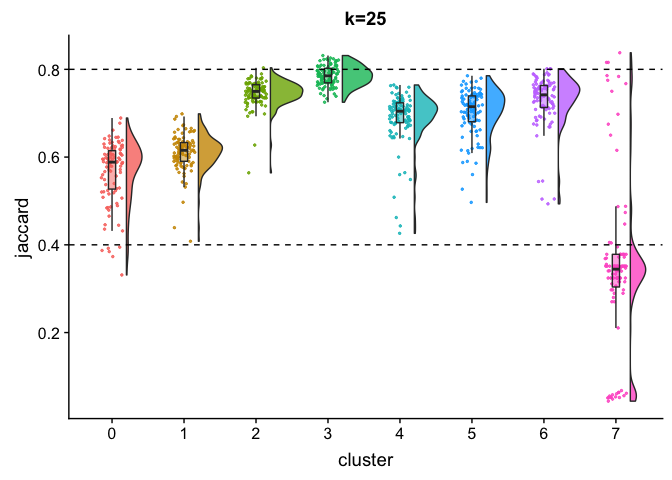
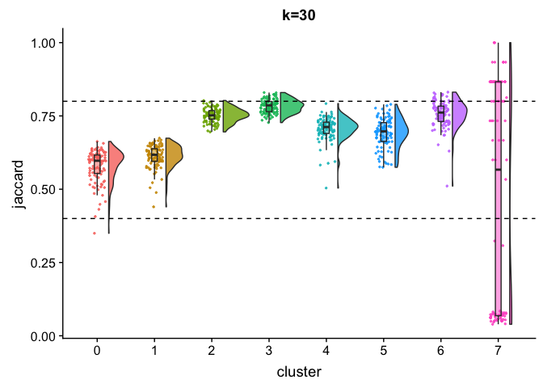
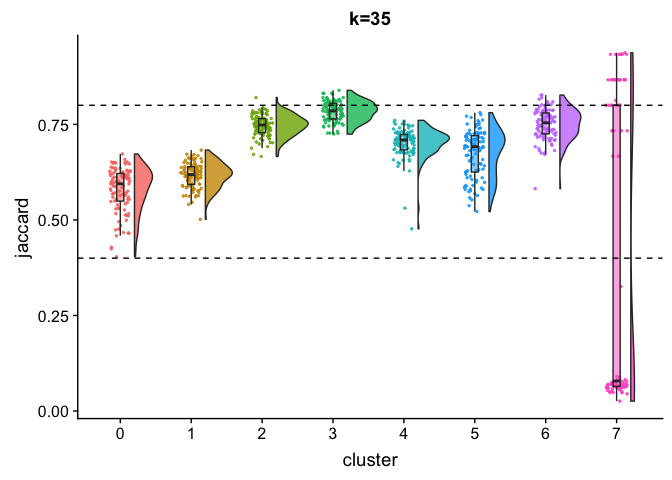
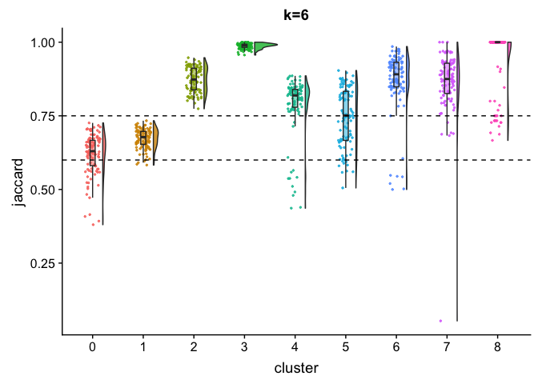

<!-- README.md is generated from README.Rmd. Please edit that file -->

# scclusteval

The goal of scclusteval is to evaluate the single cell clustering
stability by boostrapping the cells.

for Theory behind the method, see Christian Henning, “Cluster-wise
assessment of cluster stability,” Research Report 271, Dept. of
Statistical Science, University College London, December 2006)

The process is as follows (paraphased from Stephen Eichhorn in Xiaowei
Zhuang lab) :

1.  Performing the clustering at many different K values on the full
    data set.

2.  We then sample without replacement a subset of the data set
    (e.g. 80% of the cells in the full data set), and then repeat the
    clustering procedure on just this subset of data (so repeating all
    aspects of clustering, including calling variable genes, calculating
    PCs, building the neighbor graph, etc), and we do this n (default
    20) times.

3.  So for each K value, we have 1 clustering outcome for the full data
    set, and 20 clustering outcomes for subsampled portions of the data
    set. From this we identify the cluster in the first subsample
    clustering that is most similar to the full cluster 1 cells (the one
    that gives the maximum Jaccard coefficient) and record that value.
    If this maximum Jaccard coefficient is less than 0.5, the original
    cluster is considered to be dissolved-it didn’t show up in the new
    clustering. A cluster that’s dissolved too often is probably not a
    “real” cluster.

4.  Repeat this for all subsample clustering outcomes, and then the
    stability value of a cluster is the median or mean Jaccard
    coefficient. If it’s greater than 0.5 we say it’s stable, otherwise
    it’s unstable. So for a given K value this gives you a
    stable/unstable assignment for each cluster. We choose the k value
    to select for clustering the data by looking at which k value
    yielded the largest number of stable clusters while still having
    most of the cells from the data set in a stable cluster. This second
    condition is important because as you decrease K, you will always
    get more clusters, and many of them will be stable, but there will
    also be a huge number of unstable clusters, so a small fraction of
    the data set will actually be described in stable clusters are these
    values.

5.  So what we typically see is that as K decreases, we get more stable
    clusters and no unstable clusters, then you reach a point where you
    decrease K and you get more stable clusters but also some unstable
    ones, so ~95% of the data is present in stable clusters, as you go
    down in K further you get more stable clusters but now something
    like 70% of the data is present in stable clusters. I choose the k
    value where at least 90% of the data was in a stable cluster, and
    the one that yielded the most stable clusters.

6.  This is almost always the smallest K value wherein at least 90% of
    the data was stable, but occasionally you see idiosyncratic
    behaviors from a particular k value, so it wouldn’t be unheard of to
    see something where k=10 and k=8 were both \>90% with respect to
    data in stable clusters, but k=10 had more stable clusters. In
    general we end up selecting k values around 8-12 in most cases.

As a rule of thumb, clusters with a stability value less than 0.6 should
be considered unstable. Values between 0.6 and 0.75 indicate that the
cluster is measuring a pattern in the data, but there isn’t high
certainty about which points should be clustered together. Clusters with
stability values above about 0.85 can be considered highly stable
(they’re likely to be real clusters).

## Installation

You can install the scclusteval from github:

``` r
devtools::install_github("crazyhottommy/scclusteval")
```

## Useful functions

``` r
library(scclusteval)
#> Loading required package: Seurat
#> Loading required package: ggplot2
#> Loading required package: cowplot
#> 
#> Attaching package: 'cowplot'
#> The following object is masked from 'package:ggplot2':
#> 
#>     ggsave
#> Loading required package: Matrix
?RandomSubsetData
?MergeMultipleSeuratObjects
?PreprocessSubsetData
?PairWiseJaccardSets

## in Rstudio type below and tab to see all avaiable functions
## scclusteval::
```

## The bootstrap process is implemented in a Snakemake workflow

Because for each bootstrap, one has to re-run the whole process of
`FindVariableGenes`, `ScaleData`, `RunPCA`, `JackStraw` and
`FindClusters` and for large data set, it can take very long time to
run.

E.g. if you bootstrap 5 different K, and for each K you bootstrap 100
times. that’s 500 runs.

Snakemake will take advantage of the HPC cluster with large number of
CPUs avaiable.

Find the Snakemake workflow
[scBootClusterSeurat](https://github.com/crazyhottommy/scBootClusterSeurat).

## Example

This is a basic example which shows you some useful functions in the
package :

``` r
ks_idents<- readRDS("~/gather_bootstrap_k.rds")

k_20_seurat<- readRDS("~/bootstrap_k_preprocess/bootstrap_k_20.rds")
k_25_seurat<- readRDS("~/bootstrap_k_preprocess/bootstrap_k_25.rds")
k_30_seurat<- readRDS("~/bootstrap_k_preprocess/bootstrap_k_30.rds")
k_35_seurat<- readRDS("~/bootstrap_k_preprocess/bootstrap_k_35.rds")

ks_idents_original<- list(k_20_seurat@ident, k_25_seurat@ident, k_30_seurat@ident, k_35_seurat@ident)
names(ks_idents_original)<- c("k20", "k25", "k30", "k35")
```

### explore the cluster relationship between different runs

``` r
## cluster7 and cluster 8 from k20 is the same cluster7 from k25
PairWiseJaccardSetsHeatmap(PairWiseJaccardSets(k_20_seurat@ident, k_25_seurat@ident),
                           show_row_dend = F, show_column_dend = F,
                           cluster_row = F, cluster_column =F)
```



### Jaccard Raincloud plot for different Ks

``` r
JaccardRainCloudPlot(k_20_seurat@ident, ks_idents$`20`) + 
        geom_hline(yintercept = c(0.4, 0.8), linetype = 2) +
        ggtitle("k=20")
```



``` r

JaccardRainCloudPlot(k_25_seurat@ident, ks_idents$`25`) + 
        geom_hline(yintercept = c(0.4, 0.8), linetype = 2) +
        ggtitle("k=25")
```



``` r

JaccardRainCloudPlot(k_30_seurat@ident, ks_idents$`30`) + 
        geom_hline(yintercept = c(0.4, 0.8), linetype = 2) +
        ggtitle("k=30")
```



``` r

JaccardRainCloudPlot(k_35_seurat@ident, ks_idents$`35`) + 
        geom_hline(yintercept = c(0.4, 0.8), linetype = 2) +
        ggtitle("k=35")
```



### How many stable cluster and percentage of cells for each K

``` r
## for one K
AssignStableCluster(ks_idents_original$k20, ks_idents$`20`)
#> $jaccardIndex
#> # A tibble: 100 x 9
#>      `0`   `1`   `2`   `3`   `4`   `5`   `6`    `7`    `8`
#>    <dbl> <dbl> <dbl> <dbl> <dbl> <dbl> <dbl>  <dbl>  <dbl>
#>  1 0.332 0.534 0.758 0.785 0.653 0.712 0.804 0.515  0.406 
#>  2 0.621 0.642 0.708 0.780 0.704 0.603 0.712 0.0263 0.0733
#>  3 0.430 0.371 0.729 0.803 0.511 0.686 0.5   0.432  0.297 
#>  4 0.422 0.578 0.75  0.799 0.471 0.701 0.785 0.0528 0.0582
#>  5 0.582 0.622 0.735 0.780 0.730 0.728 0.705 0.0331 0.933 
#>  6 0.477 0.595 0.770 0.768 0.647 0.709 0.822 0.0458 0.867 
#>  7 0.529 0.590 0.779 0.765 0.707 0.702 0.782 0.0493 0.647 
#>  8 0.532 0.533 0.749 0.802 0.680 0.717 0.706 0.5    0.933 
#>  9 0.606 0.610 0.710 0.818 0.739 0.702 0.814 0.324  0.812 
#> 10 0.401 0.601 0.757 0.806 0.683 0.696 0.816 0.472  0.371 
#> # ... with 90 more rows
#> 
#> $stable_cluster
#>     0     1     2     3     4     5     6     7     8 
#>  TRUE  TRUE  TRUE  TRUE  TRUE  TRUE  TRUE FALSE FALSE 
#> 
#> $percent_cell_in_stable
#> [1] 0.987037
#> 
#> $number_of_stable_cluster
#> [1] 7

## for all Ks
ks_stable<- purrr::map2(ks_idents_original, ks_idents, ~AssignStableCluster(ident1= .x, idents = .y))

## access different Ks
ks_stable$k25
#> $jaccardIndex
#> # A tibble: 100 x 8
#>      `0`   `1`   `2`   `3`   `4`   `5`   `6`    `7`
#>    <dbl> <dbl> <dbl> <dbl> <dbl> <dbl> <dbl>  <dbl>
#>  1 0.373 0.439 0.769 0.777 0.688 0.719 0.713 0.351 
#>  2 0.606 0.608 0.741 0.769 0.679 0.743 0.734 0.615 
#>  3 0.580 0.611 0.746 0.789 0.672 0.659 0.675 0.324 
#>  4 0.530 0.616 0.725 0.826 0.709 0.560 0.748 0.34  
#>  5 0.622 0.642 0.726 0.820 0.728 0.743 0.788 0.698 
#>  6 0.632 0.633 0.735 0.823 0.728 0.728 0.711 0.784 
#>  7 0.520 0.598 0.738 0.808 0.709 0.694 0.752 0.311 
#>  8 0.479 0.613 0.719 0.802 0.426 0.586 0.504 0.474 
#>  9 0.587 0.661 0.737 0.809 0.725 0.704 0.742 0.333 
#> 10 0.595 0.562 0.740 0.769 0.726 0.747 0.755 0.0437
#> # ... with 90 more rows
#> 
#> $stable_cluster
#>     0     1     2     3     4     5     6     7 
#>  TRUE  TRUE  TRUE  TRUE  TRUE  TRUE  TRUE FALSE 
#> 
#> $percent_cell_in_stable
#> [1] 0.9862963
#> 
#> $number_of_stable_cluster
#> [1] 7

BootParameterScatterPlot(ks_stable)
```



## Acknowledgements

Thanks to Tim Sackton and Catherin Dulac for their supervision and
support.  
Thanks to Yasin Kaymaz in Sackton group for fruitful discussion.  
Thanks to Stephen Eichhorn in Xiaowei Zhuang lab for the idea and
sharing the python code working on
[Scanpy](https://github.com/theislab/scanpy) object.  
Thanks to Sophia(Zhengzheng) Liang in Dulac lab for sharing data and
giving feedbacks.

## Why this package?

fpc package `clusterboot`.

read this blog post
<http://www.win-vector.com/blog/2015/09/bootstrap-evaluation-of-clusters/>

## To do list

  - impurity metric for assessing cluster stability
  - plot number of clusters in each iteration.
